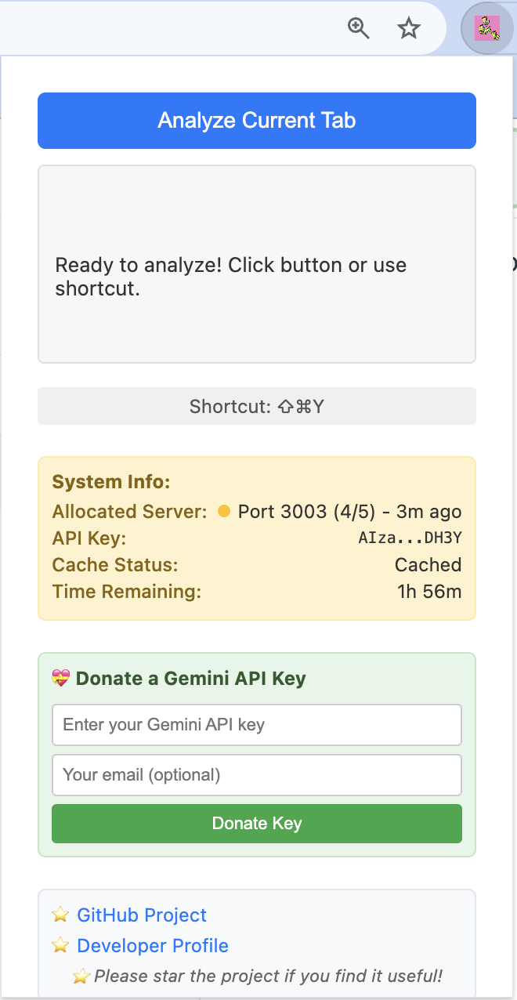
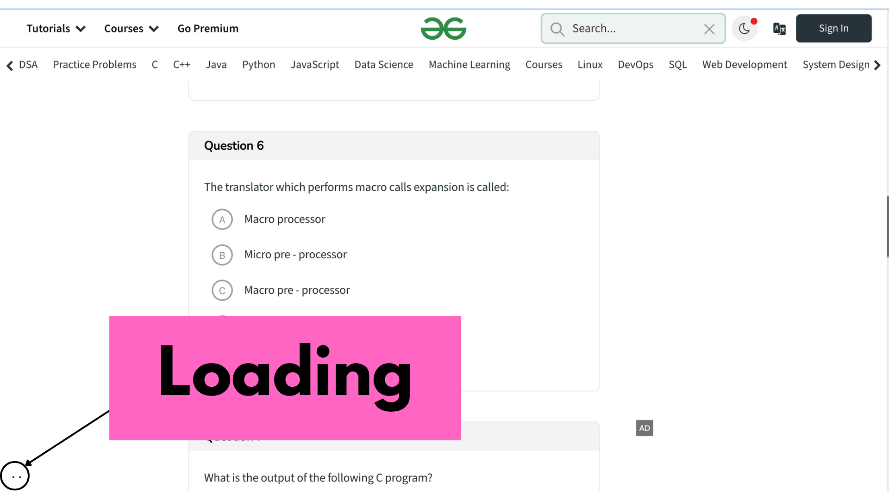
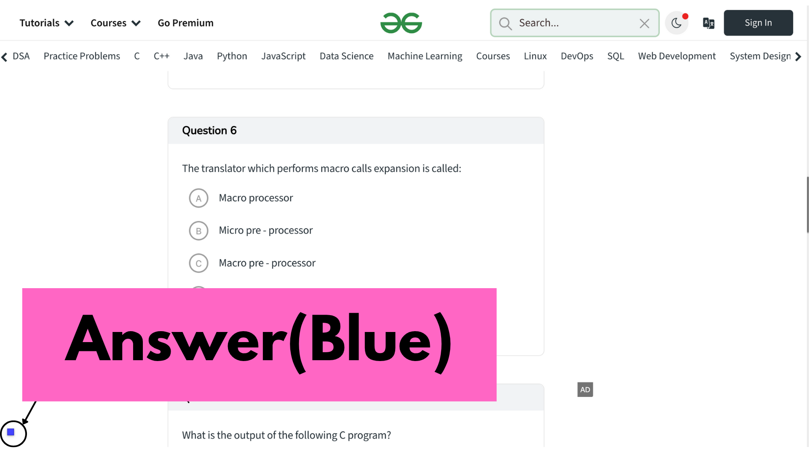
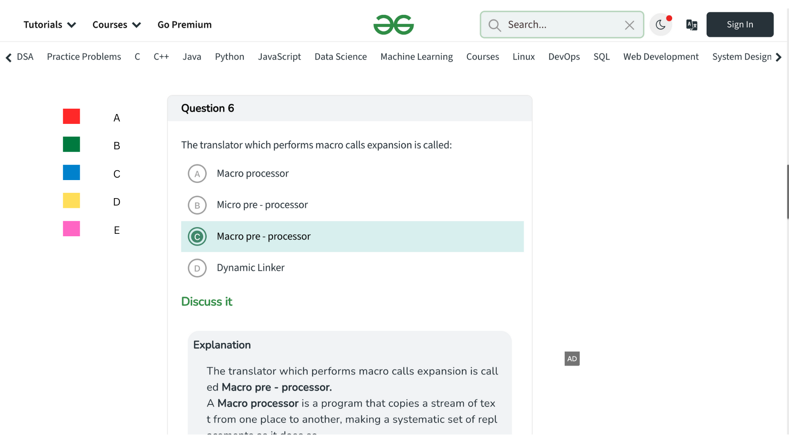

# 🎓 Kimaaka - Educational Quiz Assistant


**Version:** 3.0.1  
**Description:** An intelligent educational Chrome extension that helps students learn by providing instant visual feedback on multiple choice questions using AI-powered analysis for study assistance.maaka - Educational Quiz Assistant


## 🌟 Educational Overview

Kimaaka is a comprehensive learning assistance system designed to help students understand and learn from multiple choice questions across educational platforms:

### 🧩 Core Components

1. **🔧 Chrome Extension** - Student-friendly interface with AI-powered question analysis
2. **⚙️ Node.js Server** - Backend educational API service with AI integration  
3. **📊 Admin Dashboard** - Learning analytics and system monitoring interface

### ✨ Educational Features

- **🎯 AI Learning Assistant**: Helps students understand multiple choice questions using advanced AI
- **🎨 Visual Learning Feedback**: Color-coded answer indicators (A-E, 1-5) for better comprehension
- **🔄 Reliable Study Tool**: Intelligent server switching for uninterrupted learning sessions
- **⚡ Quick Study Aid**: Instant analysis with keyboard shortcut (Cmd+Shift+Y) for efficient studying
- **📈 Learning Analytics**: Dashboard for tracking usage and educational insights
- **🛡️ Student-Safe Design**: Visual error handling designed for educational environments

## 🎮 How Kimaaka Works

The learning process is simple and designed for educational use:

### Step 1: Activate the Learning Assistant

*Click the Kimaaka extension or press Cmd+Shift+Y to start the educational analysis*

### Step 2: AI Analysis in Progress  

*The AI analyzes the educational content to provide learning assistance*

### Step 3: Educational Feedback
  
*Visual feedback appears to help with learning and understanding - showing the correct answer highlighted with color-coded indicators*


*Example: Kimaaka successfully identified option C as the correct answer, with the visual color legend showing the extension's feedback system*

## 🚀 Quick Setup for Students & Educators

### Prerequisites for Educational Use
- Node.js 16+ (for educational institutions)
- Chrome Browser (student device)
- Educational AI API access

### Installation for Educational Environment

1. **Clone Educational Repository**
   ```bash
   git clone <repository-url>
   cd Kimaaka
   ```

2. **Setup Educational Server**
   ```bash
   cd server
   npm install
   cp .env.example .env  # Configure educational API access
   ./start-servers.sh    # Starts educational servers on ports 3000-3004
   ```

3. **Install Student Extension**
   - Open Chrome → Extensions → Developer Mode
   - Load unpacked → Select `extension/` folder
   - Pin the Kimaaka extension for easy access

4. **Launch Educational Dashboard**
   ```bash
   cd admin-dashboard
   npm run serve  # Educational analytics at http://localhost:8080
   ```

## � Educational Usage

### Learning with Kimaaka
1. **Study Session**: Navigate to any educational website with multiple choice questions
2. **Get Learning Help**: Press `Cmd+Shift+Y` (Mac) or `Ctrl+Shift+Y` (Windows)  
3. **Visual Learning**: View educational feedback with color-coded indicators:
   - 🔴 **A/1** = Red (First option)
   - 🟢 **B/2** = Green (Second option)
   - 🔵 **C/3** = Blue (Third option)
   - 🟠 **D/4** = Orange (Fourth option)
   - 🩷 **E/5** = Pink (Fifth option)
   - ⚫ **Help Needed** = Black (Indicates when additional study is recommended)

### Educational Benefits
- **Study Enhancement**: Multiple server support ensures reliable learning sessions
- **Efficient Learning**: Smart caching reduces wait times for better study flow
- **Safe Learning Environment**: Gentle error handling designed for educational use
- **Progress Tracking**: Educational analytics via admin dashboard for instructors

## 🏗️ Educational Architecture

```
┌─────────────────┐    ┌─────────────────┐    ┌─────────────────┐
│  Student        │    │  Educational    │    │  Instructor     │
│  Extension      │◄──►│  Server         │◄──►│  Dashboard      │
│  (Learning)     │    │  (AI Support)   │    │  (Analytics)    │
└─────────────────┘    └─────────────────┘    └─────────────────┘
        │                        │                        │
        ▼                        ▼                        ▼
   Learning Interface     Educational AI API      Learning Analytics
   Study Assistance       Knowledge Support       Usage Monitoring
   Progress Tracking      Multi-platform         Student Progress
```

## 📁 Educational Project Structure

```
Kimaaka/
├── extension/           # Student Chrome Extension
│   ├── manifest.json   # Educational extension config
│   ├── background.js   # Learning assistance logic
│   ├── content.js     # Study session display
│   ├── popup.html     # Student interface
│   └── config.js      # Educational server settings
├── server/             # Educational Backend
│   ├── server.js      # Learning support server
│   ├── config.js      # Educational configuration
│   └── *.sh          # Educational server scripts
├── admin-dashboard/    # Instructor Interface
│   ├── admin.html     # Educational analytics UI
│   ├── admin.js      # Learning dashboard logic
│   └── config.js     # Analytics configuration
└── README.md          # Educational documentation
```

## 🔧 Educational Configuration

### Educational Environment Variables (.env)
```bash
# Educational Server Configuration
EDUCATIONAL_AI_KEY=your_educational_api_key_here
ENVIRONMENT=educational
PORT=3000

# Instructor Dashboard Credentials  
INSTRUCTOR_USERNAME=mokani
INSTRUCTOR_PASSWORD=chokani
```

### Educational Multi-Server Setup
The learning system runs on multiple ports for reliable educational support:
- Primary Learning Server: localhost:3000
- Backup Learning Servers: localhost:3001-3004

## 🎨 Educational Color Scheme

| Option | Color | Hex Code | Learning Purpose |
|--------|-------|----------|------------------|
| A / 1  | Red   | #FF4444  | Primary option identification |
| B / 2  | Green | #44AA44  | Secondary option recognition |
| C / 3  | Blue  | #4444FF  | Tertiary option highlighting |
| D / 4  | Orange| #FFAA00  | Quaternary option marking |
| E / 5  | Pink  | #FF44AA  | Extended option support |
| Study Help | Black | #000000  | Additional study recommended |

## 🚀 Educational Deployment

### Student Development Environment
```bash
# Start educational servers
./server/start-servers.sh

# Check learning server status
./server/status-servers.sh

# Stop educational servers
./server/stop-servers.sh
```

### Educational Institution Deployment
- **Learning Server**: Deploy to educational cloud platforms (institutional hosting)
- **Student Extension**: Distribute through Chrome Web Store or institutional channels
- **Instructor Dashboard**: Deploy to educational static hosting for learning analytics

## 📊 Educational Monitoring

Access the instructor dashboard at `http://localhost:8080`:
- **Learning Server Status**: Real-time educational server monitoring
- **Student Usage Analytics**: Learning session counts and engagement metrics
- **Educational Error Tracking**: Analysis of learning assistance requests
- **Instructor Management**: Educational administrator account control

## 🛠️ Educational Development

### Student Extension Development
```bash
cd extension
# Implement educational features
# Test with educational content
# Reload extension for student testing
```

### Educational Server Development
```bash
cd server
npm run dev  # Start educational server with auto-reload
```

### Instructor Dashboard Development
```bash
cd admin-dashboard
npm run dev  # Start educational analytics dashboard
```

## 🔒 Educational Security & Privacy

- **Student Privacy Protection**: Educational dashboard uses secure local storage
- **Educational API Management**: Secure server-side educational API handling
- **Learning Environment Security**: Configured for educational domain protection
- **Student Data Validation**: Educational request validation and privacy protection

## 🐛 Educational Troubleshooting

### Common Educational Issues

1. **Learning Assistant Not Working**
   - Check if educational servers are running on ports 3000-3004
   - Verify educational API access in server/.env
   - Reload extension in Chrome for students
   - Ensure educational website compatibility

2. **Educational Server Issues**
   - Check `./server/status-servers.sh` for educational server status
   - Verify educational API credentials are valid
   - Check educational server logs in `./server/logs/`
   - Confirm educational platform connectivity

3. **Instructor Dashboard Issues**
   - Verify educational servers are accessible from dashboard
   - Check browser console for educational analytics errors
   - Ensure correct instructor credentials (mokani/chokani)
   - Test educational data connectivity

### Educational Debug Mode
Enable educational logging by setting `EDUCATIONAL_DEBUG=true` in environment variables.

## 📚 Educational Use & Academic Integrity

### Recommended Educational Use
- **Study Enhancement**: Use as a learning verification tool after attempting questions
- **Concept Reinforcement**: Helps students understand question patterns and formats
- **Study Group Activities**: Facilitate collaborative learning sessions
- **Self-Assessment**: Personal study tool for practice questions and concept review

### Academic Integrity Guidelines
- **Ethical Usage**: Students should attempt questions independently first
- **Learning Focus**: Use for understanding concepts, not just getting answers
- **Instructor Guidelines**: Educators should establish clear usage policies
- **Study Aid**: Treat as a supplementary learning tool, not a replacement for study

## 📜 Educational License

MIT License - Educational use encouraged. See LICENSE file for complete details.

## 🤝 Educational Contributing

1. Fork the educational repository
2. Create educational feature branch (`git checkout -b feature/EducationalFeature`)
3. Commit educational improvements (`git commit -m 'Add Educational Feature'`)
4. Push educational branch (`git push origin feature/EducationalFeature`)
5. Open Educational Pull Request

## 📞 Educational Support

For educational questions and support:
- Create GitHub issues for educational bugs and feature requests
- Check educational troubleshooting section
- Review component-specific educational documentation
- Contact educational support for institutional deployment

---

**Made with ❤️ for educational advancement and student learning support**
